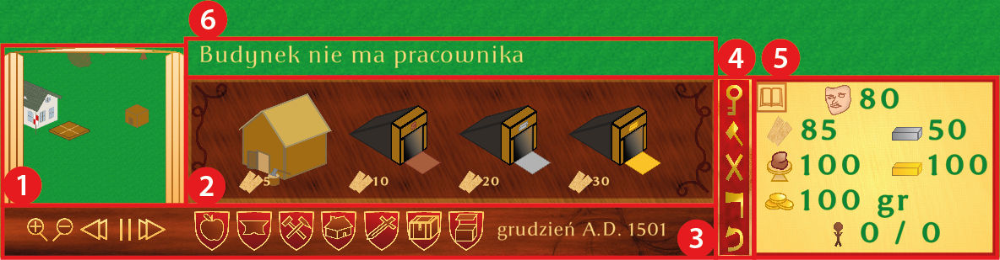
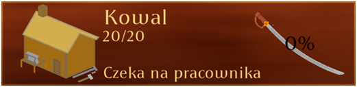
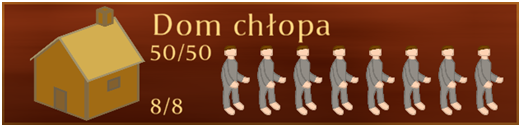

[English](../readme.md)
# Zaścianek

**Technologie**
C#, Unity, Jednostka-Komponent, GIMP, Illustrator

Gra komputerowa — strategia czasu rzeczywistego (RTS). Akcja rozgrywa się w XVI w. na wschodzie Korony Królestwa Polskiego. Zadaniem gracza jest rozbudowa wsi szlacheckiej, czyli właśnie zaścianka. 
Gra jest typowym przedstawicielem swojego gatunku. Na początku osadnik lokuje wieś, następnie należy wybudować chaty dla chłopów. Gdy pojawią się nowi mieszkańcy, należy zadbać o jedzenie i inne potrzeby takie jak religia czy bezpieczeństwo. 
Ważna jest także rozbudowa przemysłu dostarczającego półproduktów np. mąki do wypieku chleba. 
Niestety wiosce zagrażają Moskale. W celu obrony gracz musi zrekrutować chłopów, wyćwiczyć ich oraz wyposażyć w broń. Jednostki bojowe to piechur, ciężki piechur oraz kusznik. Wróg z kolei dysponuje topornikiem, łucznikiem czy również piechurem. 
Gra kończy się porażką, gdy zostanie zniszczony dworek założyciela wsi.

**Uruchamianie**
1. Pobieramy i wypakowujemy .zip z [dysku Google](https://drive.google.com/file/d/1GYoN5sAjhke5Y31g40Xxtw_gPhYFOH8-)
2. Uruchamiamy Zaścianek.exe

Menu główne 

Ustawienia 

HUD produkcji 1. Minimapa 2. Lista budynków 3. Tempo gry, zmiana grupy budynków, data 4. Pasek akcji. Od góry: zapisz i wyjdź, napraw budynek, zburz budynek, zetnij drzewo, cofnij postawienie budynku 5. Panel statystyk 6. Miejsce na komunikaty 

Budynek produkcyjny 
 
Dom chłopa 
 
Spichlerz 
 
Postawienie budynku — kopalnia gliny 

Łańcuch produkcyjny — chłop bierze mąkę ze spichlerza i idzie do piekarni 

Rekrutacja ciężkiej piechoty 

Atak jednostki w zwarciu 
