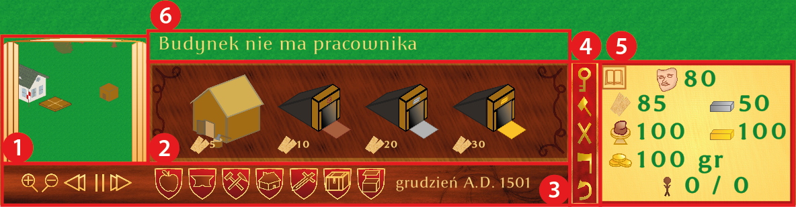
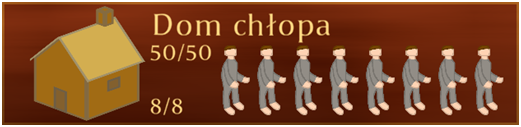
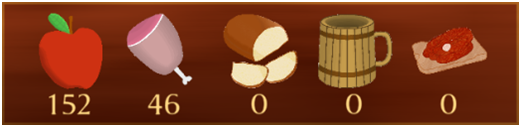

[Polski](Readme/readme_PL.md)
# Nobility Village

**Technologies**
C#, Unity, Jednostka-Komponent, GIMP, Illustrator

Computer game – real time strategy. Action time is on XVI centaury east Crown of the Kingdom of Poland. Player goal is development of nobility village (from Polish _zaścianek_). 
Game is typical representative this genre. On beginning settler set village, next player should build cottage for villagers. When new inhabitants come, player need take care of food and other needs such as religion and security. 
Another important part is development of industry, delivering intermediate products ex flour to bread baking. 
Unfortunately village is dangerous by Moskals [_Polish historical name of Russians_]. To defend player need villagers recruit, trained and equip in weapon. Combat unit is infantry, heavy infantry and crossbower. Enemy such has axer, bower and infantry. 
Game is failed, if enemy destroy house of settler.

**Launching**
1. Download and extract .zip from [Google Drive](https://drive.google.com/file/d/1GYoN5sAjhke5Y31g40Xxtw_gPhYFOH8-) 
2. Run Zaścianek.exe

Main menu 

Settings 

HUD of production 1. Minimap 2. Buildings list 3. Game speed, buildings group change, date 4. Action bar. From top: save and exit, fix building, destroy building, cut tree, undo building building 5. Statistics panel 6. Area for communicates 

Production building 
 
Villager cottage 
 
Granary 
 
Build building — clay mine 

Production chain — villager get flour from granary and go do bakery 

Heavy infratry recruitment 

Attacks of units combating cold weapon 

